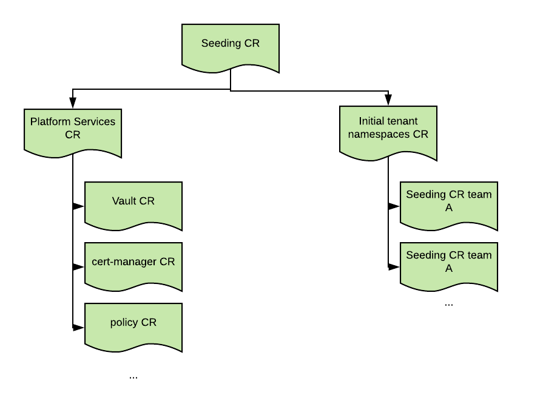

# Eunomia - a GitOps Operator for Kubernetes

[](https://gitter.im/KohlsTechnology/eunomia?utm_source=badge&utm_medium=badge&utm_campaign=pr-badge&utm_content=badge) [](https://travis-ci.com/KohlsTechnology/eunomia) [](https://quay.io/repository/kohlstechnology/eunomia-operator) [](https://goreportcard.com/report/github.com/KohlsTechnology/eunomia)

## Who is Eunomia

According to Wikipedia:

>Eunomia (Greek: Εὐνομία) was a minor Greek goddess of law and legislation (her name can be translated as "good order", "governance according to good laws"), as well as the spring-time goddess of green pastures (eû means "well, good" in Greek, and νόμος, nómos, means "law", while pasturelands are called nomia).

## What is GitOps

GitOps is all about turning day 2 operations into code! Not just that, it means you start thinking about day 2 on day 1. This is a dream come true for any Operations team!
GitOps leverages the strength of automation and combines it with the power of git based workflows. It is a natural evolution beyond infrastrcture-as-code and builds on top of DevOps best practices.

### Next Generation Change Management

Especially in large Enterprises, Change Management is usually a painful experience. GitOps allows to take a lot of that pain out and streamline the process itself. It does so by still providing what the process tries to accomplish (and thus still meet audit requirements), but does so in a way that is much faster, much more secure, and much more reliable.

Your changes now all of a sudden provide:

- Version Control
- Peer Reviews
- Approvals
- Audit Trail
- Reproducibility
- Consistency
- Reliability

What's your backout plan for your change? How about simply moving back to the previous commit and getting EXACTLY what you had before?

## Purpose

The Eunomia provides the ability to implement these git-based flows for any resources in Kubernetes. Eunomia does not care if you have a plain Kubernetes, a cloud based Kubernetes (like GKE), or a complete PaaS platform based on Kubernetes (like OpenShift). Eunomia also does not care how you want to structure your data, how many repos you want to use, or which templating engine is your favourite.

Eunomia can handle straight-up (static) yaml files with the complete definition or create dynamic ones based on your templating engine of choice. Eunomia already supports *Helm Charts*, *OpenShift Templates*, and *Jinja2 Templates*, but can easily be extended to support ohers.

These templates will be merged and processesed with a set of environment-specific parameters to get a list of resource manifests. Then these manifest can be created/updated/deleted in Kubernetes.

## Vision

While this controller can certainly be used to directly populate an individual namespace with a configuration stored in git, the vision is that a hierarchy of controllers will be used to populate multiple namespaces. Ideally this approach will be used to bring a newly created cluster to a desired configured state. Only the initial seeding CR should have cluster-level permissions. Any sub-CRs should have progressively less access assigned to their service accounts.

Here is a very simple example of how the hierarchy might look like:



The main sections of the GitOpsConfig CRD are described below.

## Example

The configuration is described in the GitOpsConfig CRD, here is an example:

```yaml
apiVersion: eunomia.kohls.io/v1alpha1
kind: GitOpsConfig
metadata:
  name: simple-test
spec:
  # Add fields here
  templateSource:
    uri: https://github.com/KohlsTechnology/eunomia
    ref: master
    contextDir: simple/templates
    secretRef: template-gitconfig
  parameterSource:
    contextDir: simple/parameters
    secretRef: parameter-gitconfig  
  triggers:
  - type: Change
  - type: Webhook
  - type: Periodic
    cron: "0 * * * *"
  ServiceAccountRef:      "mysvcaccount"
  templateProcessorImage: mydockeregistry.io:5000/gitops/eunomia-base:v0.0.1
  ResourceDeletionMode:   "Cascade"
  ResourceHandlingMode:   "CreateOrMerge"
  namespace:              "my-awesome-namespace"
```

If `namespace` is not defined, then it defaults to the same namespace the GitOpsConfig CR is defined in.

## TemplateSource and ParameterSource

The `TemplateSource` and `ParameterSource` specify where the templates and the parameters are stored. The exact contents of these locations depend on the templating engine that has been selected.

The fields of this section are:

```yaml
  templateSource:
    uri: https://github.com/KohlsTechnology/eunomia
    ref: master
    contextDir: simple/templates
    HTTPProxy: <http proxy>
    HTTPSProxy: <https proxy>
    NOProxy: <no Proxy>
    SecretRef: <gitconfig and credentials secret>

  parameterSource:
    uri: https://github.com/KohlsTechnology/eunomia
    ref: master
    contextDir: seed/parameters
    HTTPProxy: <http proxy>
    HTTPSProxy: <https proxy>
    NOProxy: <no Proxy>
    SecretRef: <gitconfig and credentials secret>
```

These are the mandatory contraints and default behaviors of the fields:

| field name  | mandatory  | default  |
|:---|:---:|:---|
| uri  | yes  | N/A  |
| ref  | no  | `master`  |
| contextDir  | no  | `.`  |
| HTTPProxy  | no  |   |
| HTTPSProxy  | no  |   |
| NOProxy  | no  |   |
| SecretRef  | no  |   |

If a secret is provided, then it is assumed that the conenction to Git requires authentication. See the [Git Authentication] (#git authentication) section below for more details.

If the `uri` is not specified in the `parameterSource` section, then it will default to the `uri` specified under `templateSource`.

### Git Authentication

Specifing a `SecretRef` will automatically turn on git authentication. The secrets for the template and parameter repos will be mounted respectively in the `/template-gitconfig` and `/parameter-gitconfig` of the job pod.
The referenced secrets must be available and how they are provisioned is beyond the scope of this operator. See the [Vision](#vision) paragraph on how to build a hierachical structure, where the resourecs needed to run a given GitOpsConfig are configured by a predecessor GitpOpsConfig instance.

This secret will be linked from `~/` of the used running the pod. The secret *must* contain a `.gitconfig` file and may contain other files. The passed `.gitconfig` will be used during the git operations. It is advised to referece any additional files via the absolute path.

#### Username and password authentication

For username and password based authentication create the following `.gitconfig`:

```ini
[http]
    sslCAInfo = /template-gitconfig/ca.crt

[user]
    name = gitconfig

[credential]
    helper = store
```

When the credential helper is of type `store`, credentials are by default retrieved from the `~/.git-credentials` file. This file should also be added to the secret and has the following format:

```text
https://<username>:<password>@<git server fqdn>
```

Don't forget to provide the `ca.crt` file to the secret.

#### Certificate based authentication

For certifciate based authentication, create the following `.gitconfig`:

```ini
[core]
    sshCommand = 'ssh -i /template-gitconfig/mykey.rsa -o UserKnownHostsFile=/dev/null -o StrictHostKeyChecking=no'
```

and add the `mykey.rsa` file to the secret.

## Triggers

You can enable one or multiple triggers.

| Name  | Description  |
|:---|:---|
|`Change` | This triggers every time the CR is changed, including when it is created.|
|`Periodic` | Periodically apply the configuration. This can be used to either schedule changes for a specific time, use it for drift management to revert any changes, or as a safeguard in case webhooks were missed. It uses a cron-style expression.
|`Webhook` | This triggers when something on git changes. You have to configure the webhook yourself.

## Template Engine

When it's time to apply a configuration, the GitOps controller runs a job pod. The image of the job pod can be specified in the `templateProcessorImage` field.
This is the plugin mechanism to support multiple template engines.
A base image is provided that can be inherited to simplify the process of adding support for a new templating engine.
The base image provides the following workflow:

1. `gitClone.sh` : This will clone the template and parameter repos. It is expected that there will be no need to customize this. Any required changes are most likely worthy of a pull-request upstream.
2. `discoverEnvironment.sh` : This will create a set of environment variables that are specific to the target Kubernetes environment. Currently the following variable are supported:

    | Name  | Description  |
    |:---|:---|
    | `CA_BUNDLE`  | Platform-level CA bundle  |
    | `SERVICE_CA_BUNDLE`  | Service-level CA bundle  |
    | `DEFAULT_ROUTE_DOMAIN`  | Base route domain for the default router  |
    | `NAMESPACE`  | Current namespace  |
3. `processTemplate.sh` : This shell that needs to be overwritten in order to support a different templating engine. The contract is the following:

    - Templates are available at the location specified by the variable: `CLONED_TEMPLATE_GIT_DIR`
    - Parameters are available at the location pecified by the variable: `CLONED_PARAMETER_GIT_DIR`
    - After the template processing completes, the processed manifests should be stored at the location of this variable: `MANIFEST_DIR`

4. `resourceManager.sh` :  Processes the resources in `MANIFEST_DIR`. One or more files can be present, and all will be processed.

Currently the following templating engines are supported (follow the link to see examples of how new template processors can be added):

- [Raw Manifests](./template-processors/base)
- [OpenShift Templates](./template-processors/ocp-template)
- [Helm Charts](./template-processors/helm)
- [Jinja Templates](./template-processor/jinja)

## serviceAccountRef

This is the service account used by the job pod that will process the resources. The service account must be present in the same namespace as the one where the GitOpsConfig CR is and must have enough permission to manage the resources. It is out of scope of this controller how that service account is provisioned, although you can use a different GitOpsConfig CR to provision it (seeding CR).

## Resource Handling Mode

This field specifies how resources should be handled, once the templates are processed. The following modes are currently supported:

1. `CreateOrMerge`, which is roughly equivalent to `kubectl apply`.
2. `CreateOrUpdate`, which will overwrite any existing configuration.
3. `Patch`. Patch requires objects to already exists and will patch them. It's useful when customizing objects that are provided through other means.

## Resource Deletion Mode

This field specifies how to handle resources when the GitOpsConfig object is deleted. Two options are available:

1. `Retain`, resources previsouly created are left intact.
2. `Delete`, resources are delete with the `cascade` option.

## Installing Eunomia

### Installing on Kubernetes

Here are some preliminary instructions. This still needs a lot of TLC. Feel free to send in PRs.

```shell
minikube start
kubectl create namespace eunomia-operator
kubectl apply -f ./deploy/kubernetes/crds/gitops_v1alpha1_gitopsconfig_crd.yaml
kubectl delete configmap eunomia-templates -n eunomia-operator
kubectl create configmap eunomia-templates --from-file=./templates/cronjob.yaml --from-file=./templates/job.yaml -n eunomia-operator
kubectl apply -f ./deploy/kubernetes -n eunomia-operator
```

### Installing on OpenShift

Run the following to deploy eunomia:

```shell
oc project eunomia-operator
oc apply -f ./deploy/kubernetes/crds/gitops_v1alpha1_gitopsconfig_crd.yaml
oc delete configmap eunomia-templates -n eunomia-operator
oc create configmap eunomia-templates --from-file=./templates/cronjob.yaml --from-file=./templates/job.yaml -n eunomia-operator
oc apply -f ./deploy/kubernetes -n eunomia-operator
oc apply -f ./deploy/openshift -n eunomia-operator
```

## Examples / Demos

We've created several examples for you to test our Eunomonia. See [EXAMPLES](examples/README.md) for details.

## Development

Please see our [development documentation](DEVELOPMENT.md) for details.

## Troubleshooting

Please see our [troubleshooting guide](TROUBLESHOOTING.md) for details.

## License

See [LICENSE](LICENSE) for details.

## Code of Conduct

See [CODE_OF_CONDUCT.md](.github/CODE_OF_CONDUCT.md)
for details.
