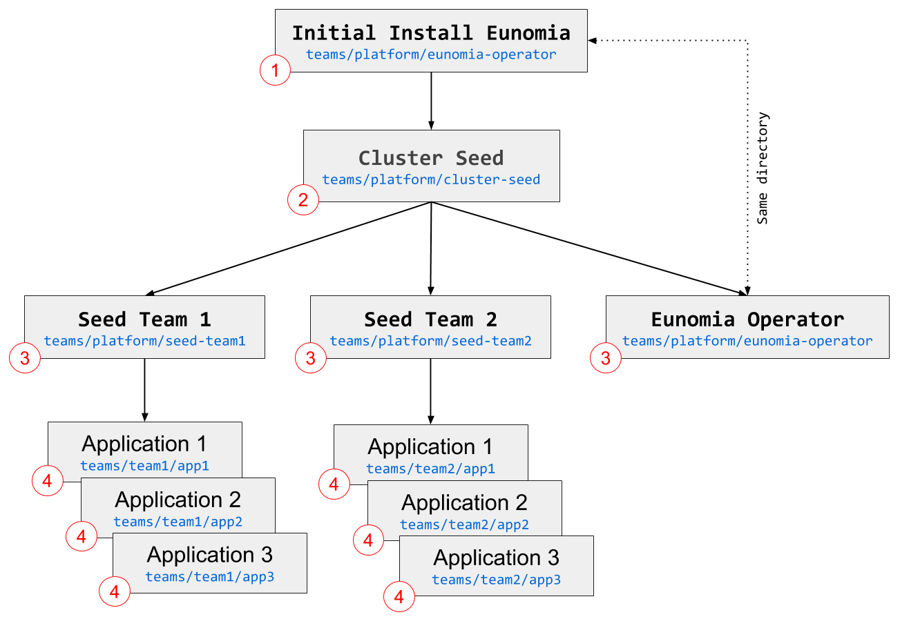

# Cluster Example

This example reflects a more real-world scenario. We are starting with a completely empty cluster, then use a "cluster seed" custom resource (CR) to provision all components and end up with a fully functioning and fully configured Kubernetes cluster.

# Video

You can watch a video of this demo here: https://youtu.be/W__MvizKo3w

# Structure

In order to keep things simple, we're going to use the same git repo with a folder structure under it. In the real world, you would break out the various team folders into at least one repo each. How exactly this would look like, heavily depends on your requirements and organizational structure.



1. Eunomia needs to be initially installed via whatever orchestration you use for your Kubernetes installation. In our example, we simply execute it via the command line.

2. The cluster seed is the main custom resource and uses a service account with superpowers (cluster-admin), since it is responsible for all the cluster-level tasks.

3. The cluster seed provions the "team seeds", which all use service accounts with less access (you delegate responsibilities to those teams).  It also provisions resources that are needed to run the whole K8S cluster (monitoring, logging, etc.). Our example showcases how Eunomia is used to manage itself.

4. The team seeds manage the various applications. In our example, each team deploys 3 demo hello-world applications that are completely managed through GitOps.

This is it! You now have a fully functiontioning and fully configured K8S cluster!

# Executing the demo

```shell
# Create the CRD
kubectl apply -f ./deploy/crds/eunomia_v1alpha1_gitopsconfig_crd.yaml

# Create the namespace
kubectl create namespace eunomia-operator

# Generate the configmap with the details for the runners
kubectl create configmap eunomia-templates --from-file=./templates/cronjob.yaml --from-file=./templates/job.yaml -n eunomia-operator

# Create the namespace for the cluster-seed
kubectl create namespace eunomia-cluster-seed

# Initial configuration of the cluster seed
helm template -f examples/cluster/teams/platform/cluster-seed/parameters/values.yaml examples/cluster/teams/platform/cluster-seed/templates/ | kubectl apply -f -

# Deploy the operator
helm template -f examples/cluster/teams/platform/eunomia-operator/parameters/values.yaml examples/cluster/teams/platform/eunomia-operator/templates/ | kubectl apply -f -

```

At this point the cluster should be "magically" configuring itself and within a few minutes all resources should be available.

```shell
# Watch the magic happening
kubectl get pods --all-namespaces -w 
```
